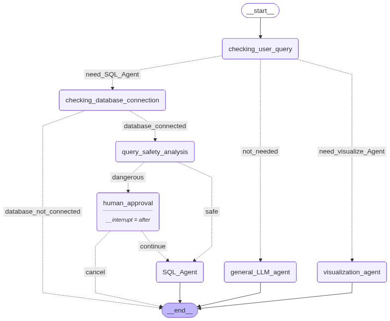

# SQLAgent — AI-Powered Data Analyst  

**SQLAgent** is an intelligent, full-stack AI system that understands natural language, executes SQL queries safely (with human approval for risky operations), and visualizes insights instantly — all through a conversational chat interface.  

Built with **LangGraph**, **Langchain**,**FastAPI**, it behaves like your personal AI data analyst that can think, reason, and act safely.

---

## ⚡️ Key Features  

✅ **Natural Language Understanding**  
- Ask questions like *“Show me total sales by region this month”* — SQLAgent automatically understands and generates the correct SQL query.  

✅ **Safe SQL Execution (HITL) - Human in the loop**  
- Before running any destructive operation (like `DELETE`, `UPDATE`, or `DROP`), the system pauses and asks for **human approval** to prevent accidental data loss.  
✅ **Interactive Visualization Agent**  
- When results require insights, SQLAgent generates and displays **charts** (bar, line, pie, etc.) directly in the chat interface.  

✅ **LangGraph-Based Workflow**  
- A modular AI workflow built with LangGraph controls routing between SQL execution, visualization, and general chat.  

✅ **FastAPI Backend + Real-Time Streaming**  
- The backend streams AI responses in real-time for a smooth conversational experience.  

✅ **Modern Frontend UI**  
- Clean chat interface with typing animations, light/dark mode toggle, and dynamic chart display.  

---

## 🧩 Langgraph Workflow Overview  
- The following diagram shows how SQLAgent routes user queries between nodes in LangGraph:

## 🖥️ Tech Stack

| Layer | Tools / Libraries |
|-------|-----------------|
| Frontend | HTML, CSS, JavaScript (Chat UI + Visualization) |
| Backend | FastAPI (Async REST + Streaming) |
| AI Orchestration | LangGraph + LangChain |
| Models | Gemini (Google Generative AI) + HuggingFace LLM |
| Visualization | Matplotlib / Seaborn |
| Database | SQLite (Demo) — supports PostgreSQL/MySQL integration |

## 🚀 Demo

